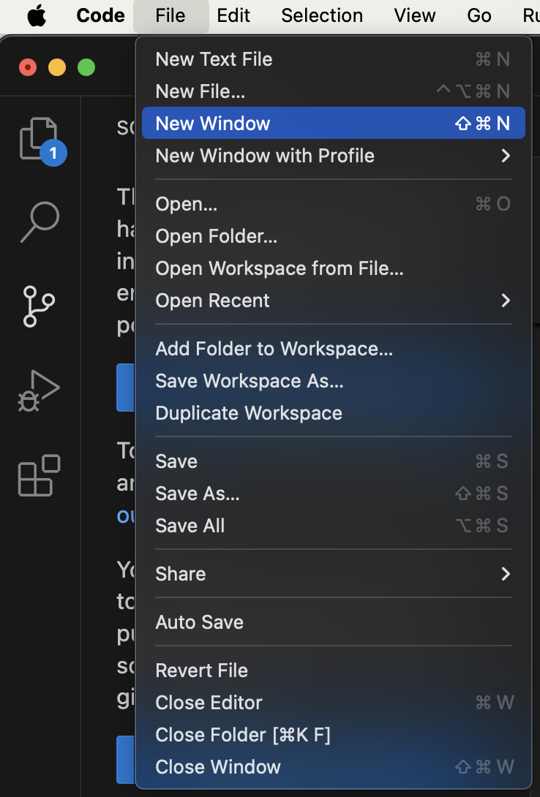
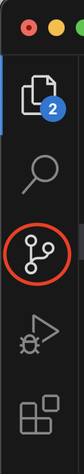
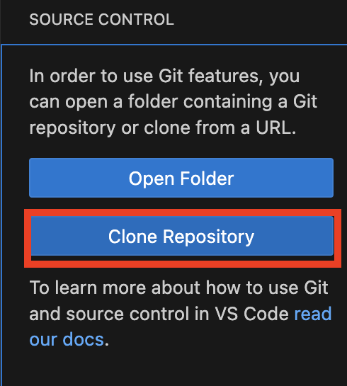
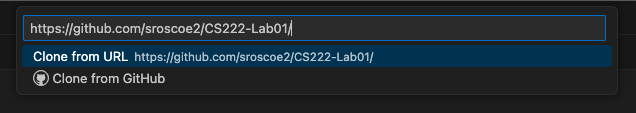
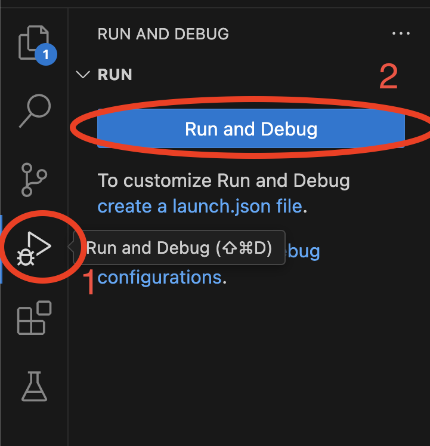
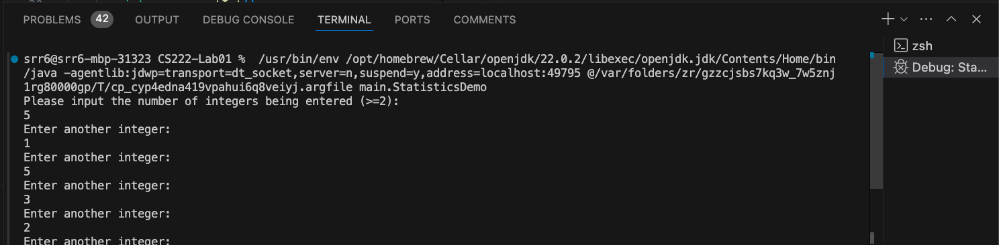

# Programming II
## Lab 1.0: Introduction
Introduction to the Java programming language and tools, including Visual Studio Code (VS Code), git client, etc., followed by an introduction to using conditionals and loops in the Java programming language.

This is a lab assignment based on one used in Computer Science II (CSCE 156 & 156H) in the School of Computing
at the University of Nebraska-Lincoln. 
Originally written by Chris Bourke. Revised and modified by Sarah Roscoe for CS222 at [Saint Mary's College of California](https://www.stmarys-ca.edu/) in Fall 2024. 

## Overview

### Prior to Lab

You should read any resources provided to you prior to working on the lab assignment. Failure to do so may result in your falling behind on the material.


### Resources
Prior to lab you should read/review the following resources.
* `if-else tutorial`:
http://download.oracle.com/javase/tutorial/java/nutsandbolts/if.html
* `for` loop tutorial:
http://download.oracle.com/javase/tutorial/java/nutsandbolts/for.html
* `while` loop tutorial:
http://download.oracle.com/javase/tutorial/java/nutsandbolts/while.html


### Lab Objectives & Topics
Following the lab, you should be able to:
* Clone projects from GitHub using VS Code
* Open, compile, and execute a given Java program in VS Code.
* Write a simple program in the VS Code IDE, compile, and 
  execute that program.
* Use `if-else` statements to control the logical flow of the
  program.
* Use `for` and `while` loops to implement repetition statements in a
  program.
* Write complex programs that require conditional logical statements
  and loops.

### Pair Programming

You may work on this lab with a partner. You may work on one piece of code, but both of you should submit the work. You may send your partner a copy of the file and therefore turn in identical copies. You should also indicate on Canvas who you worked with. **Both of you should indicate your partner in a submission comment**. 

In pair programming, one person is the *driver* and the other is the *navigator*. The driver is responsible for the computer keyboard and mouse. The navigator is responsible for figuring out what should be done, and telling the driver what to do. Neither role is "in charge", but both are responsible for coming up with solutions together. 

Each week, you should try to alternate: if you were the driver last week, you should be navigator this week, or vice versa. Any conflicts should be resolved in your group. 

## 1. Getting Started

### 1.1. Install VS Code
Visual Studio Code (VS Code) is a text editor and IDE that supports many programming languages. 
Many other IDEs exist and are popular among programmers. You may use or try others if you wish. However, we may not be able to help you with course assignments if you are using a different IDE (we will certainly try!). Download and install VS Code for your system at the following link: 

https://code.visualstudio.com/download 

Once you do that, **you should also install  "Extension Pack for Java"**.

#### 1.2. Install Java Developer Kit (JDK)
You may already have "Java" installed on your computer, but this
is most likely the Java Virtual Machine (JVM) that allows you to
run Java programs.  To actually develop Java programs you need a
Java Development Kit (JDK). 

After you install the "Extension Pack for Java", It will prompt you to install a JDK. 
You may install the default option given to you by VS Code. 

If you want to do it separately, here is a link to install an open-source JDK:
https://adoptium.net/
There are several alternative JDKs and you are welcome to explore them.

## 2. Cloning a repository from Github
Each lab will have some starter code and other *artifacts* 
(data files, scripts, etc.) that will be provided for to you.  
The code is hosted on Github (https://github.com) and you must 
*clone* your own copy to work with it.  You will not need to 
know the details of using git nor be a registered Github user 
to get access to the code necessary for your labs.  However, 
you are *highly encouraged* to learn this essential tool.  
You may find it very useful to keep track of your own code 
and to share code if you work in pairs or groups.  

To check out the code for this lab, do the following.  You may 
want to reference this step-by-step process in subsequent labs.

1. Open a new window in VS Code. You can find the shortcut by going to the menu option `File -> New Window` on the top left of your screen. 
<p align="center">

</p>  

2. Click on the "Source Control" tab on the left hand side of VS Code. 

<p align="center">

</p>  

3. Then click "Clone Repository".

<p align="center">

</p>  

4. Copy/paste or type the URL into the text box that appears:

https://github.com/sroscoe2/CS222-Lab01/

<p align="center">

</p>  

5. Choose the directory where you want your project to be saved. **The default option may not be ideal.** You should save the project in the same overall directory as your other Java projects for this class.

6. Click "Open" and provide access, trust the authors, etc. 

7. Return to the "Explorer" view (with a file image on the left sidebar) to return to the code.

## 3. How to do things in Java
## 3.1. Running and Editing Programs
### 3.1.1 Running a Program

You will now edit an existing
project's code  to get used to VS Code.

1. Expand the `src` directory. Here, we have a *package* named `main` and a package named `test`. Java classes are organized in a hierarchy of packages to group similar or related code together. Packages correspond to actual directories (folders) on your computer.

2. Expand the `main` package to find several *classes*. All code in Java is a class or part of a class. Other languages may allow global variables or functions without an object or class; not so in Java. 

3. Click on the `StatisticsDemo` class to open it in the VS Code editor. This class contains a main method, `public static void main(String args[])`
In Java, classes are executable only if a main method is defined.  
Classes without a `main` method can be used by other classes, but 
they cannot be run by themselves as an entry point for the Java 
Virtual Machine (JVM).

4. Click on the play button on the left hand column (Run and Debug), then click on the big button labeled "Run and Debug". 

<p align="center">

</p>  

5. The output for this program will appear in the "Terminal" tab at the bottom of your screen.

6. Click on the "Terminal" tab and enter the input as specified.

<p align="center">

</p>  

NOTE: If you ever close the terminal, you can open it again by pressing `` ctrl + ` `` (backtick, found above the `tab` key).  Alternatively, you can use the top menu `View -> Terminal` option to open it again. 

### 3.1.2 Completing the Statistics Program

Though the program runs, it does not output correct answers.  You 
will need to modify these classes to complete the program.

1. Implement the `getMax()` method in the `Statistics` class.  Use the 
`getMin()`	method for directions on syntax.
2. Implement the `getSum()` method in the `Statistics` class.  Use the 
other methods for direction on syntax.
3. Rerun the program to verify that it now works.

### 3.1.3 Modifying the Statistics Program

The program you've completed is interactive in that it prompts the 
user for input.  You will now change the program to instead use *command 
line arguments* to read in the list of numbers directly from the command 
line.

Command line arguments are available to your main method through 
the `args` array of Strings.  The size of this array 
can be obtained by using `args.length` which is an
integer.  Modify your code to iterate through this array and convert 
the arguments to integers using the following snippet of code:

```java
for(int i=0; i<args.length; i++) {
  array[i] = Integer.parseInt(args[i]);
}
```

The *command line* may not be apparent as you are using an IDE.  
However, it is still available to you.  Instead of clicking the "Play" 
button to run your program, click the link in the "Run and Debug" tabs to create a `launch.json` file. 
You will see a list of configurations in curly brackets. 


*Add a comma to the last configuration line*, then add a new line that says "args":"[NUMBERS]", where `[NUMBERS]` is replaced by a list of space-delimited numbers, such as "5 12 502 6723 34".
Save the JSON file, then click the play button to run your code. 

Example line:

`"args":"5 12 502 6723 34"`


## 4. IDE Orientation

Now we will review some functionality that VS Code provides. 

### 4.1 Using External Libraries

No man is an island.  Good code depends on selecting and (re)using 
standard libraries whenever possible so that you are not continually 
reinventing the wheel.  This activity will familiarize you with how 
to import and use an external Java library.  Java libraries are 
usually packaged into JAR *J*ava *AR*chive files which contain a 
collection of compiled class files and other resources necessary 
to use the library.

1. There may be compilation errors in the `Birthday.java` 
file.  This is because this class uses other classes that are not 
available in the standard Java Development Kit (JDK).  It instead 
uses classes from the Joda-Time library; a library of useful classes 
and utilities for dealing with dates, times, intervals, durations, etc.
2. The JAR file, `joda-time-2.0.jar` has been included in the project 
in the `lib` folder.  External libraries are usually kept in a hierarchy 
of folders like this (you can create your own folders by right-clicking 
the project and selecting "Add folder to workspace").
3. *If there are compilation errors in `Birthday.java`*, open the "JAVA PROJECTS" menu at the bottom of the Explorer view. 
4. Scroll down to "Referenced Libraries", and click the plus button. 
5. Navigate to the `joda-time-2.0.jar` file and select it. 
6. Run `Birthday.java` to see if the errors have gone away. 


### 4.2 Cleaning Up

Though the syntax errors should now be resolved, the code isn't pretty
making it difficult to read and understand.  VS Code provides a built-in
code formatter functionality.  Typically if you write good code to begin
with it will automatically provide consistent indentation and other 
stylistic features.  It is best practice to get in the habit of writing 
good, clean code automatically.  However, if you need to clean up a file 
in one shot you can do use the auto-formatter feature.  

* On Windows: press `I DON'T KNOW` to reformat the code
* On Mac: press `option-shift-f` to reformat the code

Another issue with the code is that it is using `lower_underscore_casing` 
for some of its variables.  Change the variable names to the preferred 
`lowerCamelCasing` convention in Java.  You could do this manually but 
a neat trick that most IDEs provide is as follows.

1. Highlight the variable name (any instance will do)
2. Right click and select `Rename Symbol`.
3. Type the new variable name and hit enter and it will automatically 
be changed for all instances!  

Finally, every *non-trivial* class and method should have documentation.
In Java, it is standard to use doc-style or "javadoc" comments.  Look
at the `Statistics.java` file again to see the format for these style of comments.
Add documentation to this file to complete it.

### 4.3 Finishing The Program

Though the program should have no syntax errors, if you run it, no 
output will be displayed.  You need to complete the program as follows.

1. For the variables, name, month, date, and year, enter your own 
information (your name and your birthday)
2. Add appropriate code (using `System.out.println()`) which prints 
to the standard output a full line, a greeting similar to the following. 
`Greetings, NAME.  Today you are XX years, XX months, and XX days old.`
Of course, the placeholders should be replaced with variable values.  
In Java, variable values can be concatenated with strings using the `+` 
(plus) operator.
3. Add a conditional statement that, if today is the user's birthday 
will output `Happy Birthday`.  If it is not the user's birthday, output 
`Your friends have XX shopping days until your next birthday`
again with an appropriate variable value.


# Part 2

## 5. Conditionals & Loops

Java provides standard control structures for conditionals and
repetition. Specifically, Java provides the usual `if-else`
statements as well as `for` and `while` loops. The syntax for these
control structures should look familiar.  Some examples:

```java
if(x > 0) {
  //DO SOMETHING
} else if(x < 0) {
  //DO SOMETHING ELSE
} else {
  //OTHERWISE
}

for(int i=0; i<n; i++) {
  //DO SOMETHING
}

int i = 0;
while(i < n) {
  //DO SOMETHING
  i++;
}
```

In addition, Java provides a foreach-loop, also referred to as an
*enhanced for-loop*, for iterating over collections or elements in an 
array.  This feature is mostly for convenience.  The following example
demonstrates how to use this loop.

```java
String arr[] = new String[10];
...
for(String s : arr) {
  System.out.println(s); 
}
```

An enhanced for-loop can be used for `Set` and `List` collections.

## 6. Activities 

### 6.1 Sum of Natural Numbers

Natural numbers are the usual counting numbers; 1, 2, 3, ... In this
exercise you will write several loops to compute the sum of natural
numbers 1 thru `n` where `n` is read from the command line. You will
also write an enhanced for-loop to iterate over an array and process
data.

1.  Open the `Natural.java` source file. The code to read in `n` has been
    provided for you. An array mapping integer values 1 thru 10 to text
    values has also been created for you.

2.  Write a `for`-loop and a `while`-loop in the relevant methods to
    compute the sum of natural numbers 1 thru `n` and return the 
    result.  In the `main` method call your methods and output 
    the result.  
    
3.  Write a an enhanced for-loop to iterate over the elements of the `zeroToTen`
    array. As you iterate over the elements, concatenate each
    string, delimited by a single space to a result string and print the
    result at the end of the loop. Your result should look something
    like the following:
    
    `zero + one + two + three + four + five + six + seven + eight + nine + ten = 55`

### 6.2 Child Tax Credit

When filing for federal taxes, a credit is given to tax payers with
dependent children according to the following rules. The first dependent
child younger than 18 is worth a $1,000.00 credit. Each dependent child
younger than 18 after the first child is worth a $500 tax credit each.
You will complete a Java program to output a table of dependent
children, how much each contributes to a tax credit, and a total child
tax credit. Your table should look something like the following.

```text
Child           Amount
Tommy (14)      $1000.00
Richard (12)    $500.00
Harold (21)     $0.00
Total Credit:   $1500.00
```

1.  Open the `Child.java` and `ChildCredit.java` source files

2.  The `Child` class has already been implemented for you. Note how the 
    `Child` class is used.  Several instances of children have been created 
    and placed into a `List`.

    Similar to an array, a `List` stores elements using 0-indexing. Each one
    can be accessed using the `get` method. For example, `kids.get(i)` gets 
    the i-th kid.  You could also use an *enhanced for loop* to iterate over 
    the elements in the `List`.

3.  Implement the `produceReport` method to compute the child tax credit(s)
    and output a table similar to the one above.  Your method should return
    the grand total of the credit.  
    
    Each child is an *instance* of the `Child` class. Each instance has its own
    variables so that each child can be a different age. To get a
    particular child’s age, you can use a *getter* method. For example,
    to get the age of `tom` you can use the syntax, `tom.getAge()`

### Advanced Activity (Optional)

Use the `String.format()` method to reformat the output of the Child Tax 
Credit program to print every piece of data in its own column.


## 7. Testing, Submitting, & Grading your lab

### 7.1 Testing

Every lab will come with a collection of test files that contain 
a suite of *unit tests* using the JUnit testing framework.  Before
you submit your lab, you should run these tests locally to verify 
that your code is correct.  

1. Open the `StatisiticsTests.java` source file in the `src/test`
source folder.  This file contains several unit tests written using
JUnit *annotations*.  You are encouraged to explore how these tests
are written and work and to even add your own tests but otherwise, 
the file is complete.
2. Run the test suite by clicking on the icon to the left of the line that says `public class StatisticsTests`. If there are failed tests, you will need to click "Continue" or "Always Continue" in a VS Code popup. You may view the JUnit report in a "Test Results" tab in your console at the bottom of the screen. This will detail which test cases pass and
which fail along with expected output and the actual output (for 
failed test cases).  
3. Address any issues or failing tests by debugging your code and 
rerun the test suite until all tests pass.

When all test cases pass, you will get 100% on that assignment. If a portion of your test cases do not pass, the portion of failed tests will be subtracted from your assignment grade. 

### 7.2 Submitting
When you are done with the assignment, submit it to Canvas.

1. Open a browser to https://stmarys-ca.instructure.com/ 
2. Login and select our course. 
3. Navigate to the "Lab 1" assignment and click on it. 
4. Hand in the following files:
  * `Natural.java`
  * `ChildCredit.java`
  * `Statistics.java`
  * `Birthday.java`
You can either click to upload files from your file explorer, or you can drag-and-drop the files. 
You 
will be able to re-handin the same file as many times as you want up 
until the due date.